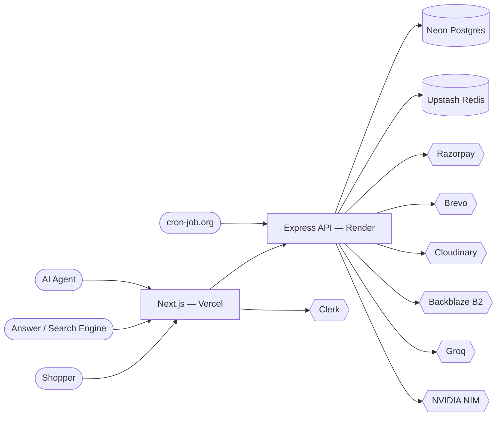
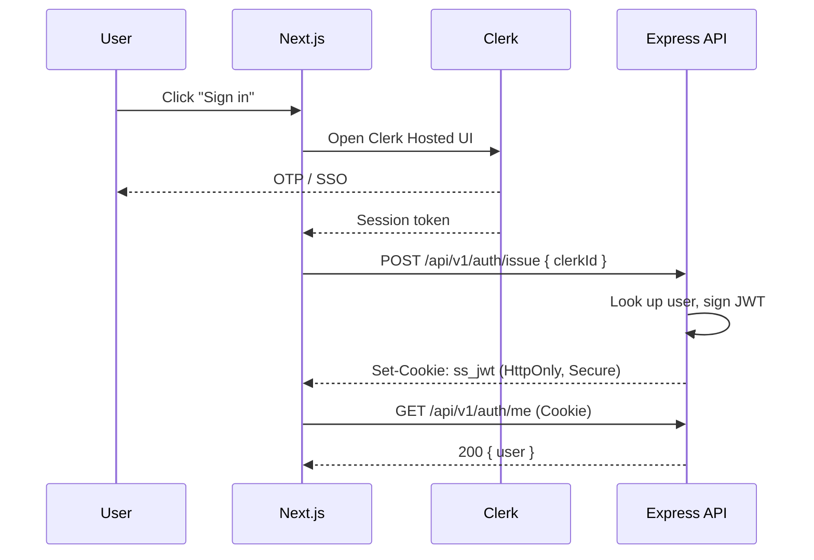
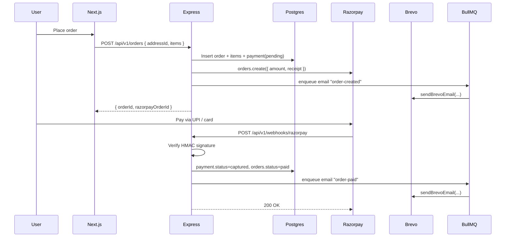
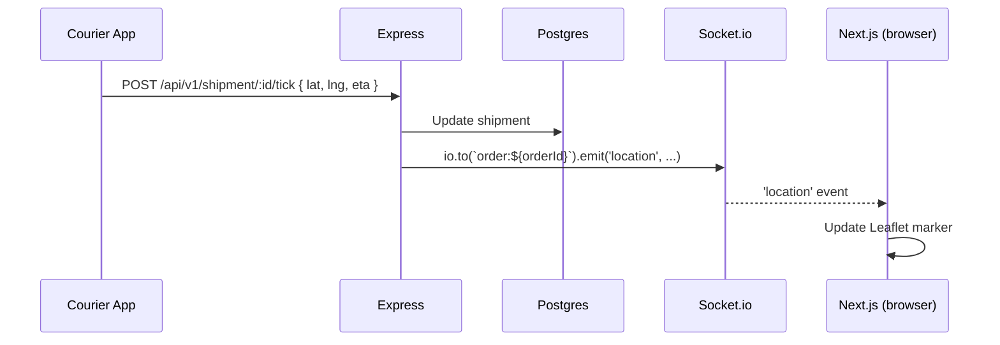
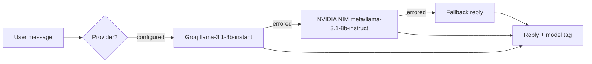

# ShopStream — Architecture

> High-level system architecture with Mermaid diagrams.

## 1. Context (C4 Level 1)



## 2. Containers

```mermaid
flowchart TB
  subgraph Browser
    UI[Next.js App Router]
    Store[Zustand cart store]
    SW[Service Worker]
  end

  subgraph Vercel
    UI
  end

  subgraph Render
    API[Express API]
    WS[Socket.io]
    Q[BullMQ workers]
  end

  subgraph Neon
    DB[(Postgres)]
  end

  subgraph Upstash
    R[(Redis)]
  end

  UI <--> WS: wss
  UI --> API: https /api/v1
  API --> DB
  Q --> R
  API <--> R: cache + queues
```

## 3. Authentication Sequence



## 4. Checkout Sequence



## 5. Real-time Tracking



## 6. AI Chat Routing



## 7. Deploy Topology

| Component | Host | URL |
|---|---|---|
| `apps/web` | Vercel | `https://shopstream.vercel.app` |
| `apps/api` | Render Web Service | `https://shopstream-api.onrender.com` |
| Postgres | Neon | `postgres://…neon.tech/shopstream` |
| Redis | Upstash | `https://…upstash.io` |
| Object storage | Backblaze B2 | `https://…b-cdn.net` |
| CDN | Cloudinary | `https://res.cloudinary.com/…` |
| Cron | cron-job.org | `GET /healthz` every 5 min |

## 8. Why this split?

- Vercel excels at edge-rendered React + image optimization + analytics.
- Render keeps a single long-lived Node process for Socket.io, BullMQ workers, webhooks, and easy health probes.
- The two communicate over a tight JSON contract; both read the same Drizzle schema.
