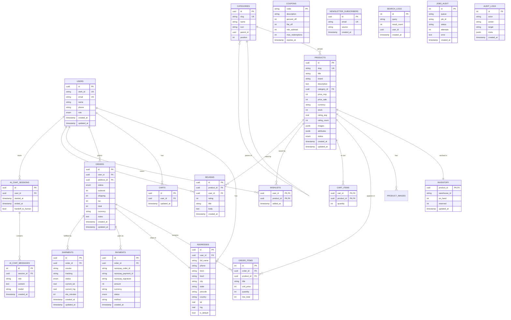

# ShopStream — Database Schema

> Drizzle ORM schema for Neon Postgres. Source of truth: `packages/db/src/schema.ts`.

## 1. ER Diagram



## 2. Indexes & Constraints

- `users(clerk_id)`, `users(email)` — unique.
- `categories(slug)` — unique.
- `products(slug)` — unique; `(category_id)` and `(status)` indexed.
- `orders(user_id)`, `orders(status)` — indexed.
- `cart_items(cart_id, product_id)` — composite PK.
- `wishlists(user_id, product_id)` — composite PK.

## 3. Money

All prices are stored in **paise (integer)**. INR × 100 = paise. Conversion to rupees happens in the UI layer (`inr(paise)`).

## 4. Status Enums

| Enum | Values |
|---|---|
| `user_role` | `user`, `admin` |
| `order_status` | `created`, `paid`, `packed`, `shipped`, `delivered`, `cancelled`, `refunded` |
| `payment_status` | `pending`, `captured`, `failed`, `refunded` |
| `product_status` | `draft`, `active`, `archived` |
| `shipment_status` | `pending`, `picked_up`, `in_transit`, `out_for_delivery`, `delivered`, `exception` |

## 5. Migrations

```bash
pnpm --filter @shopstream/db generate     # generates SQL from schema
pnpm --filter @shopstream/db migrate      # applies pending migrations
pnpm --filter @shopstream/db seed         # populates ~70 demo SKUs
```

## 6. Conventions

- All `id` columns are `uuid` and server-generated via `defaultRandom()`.
- All timestamps are `timestamptz` and default to `now()`.
- Soft-deletes are **not** used; archives flip `products.status = 'archived'`.
- All FKs cascade on user/cart/order deletion.
