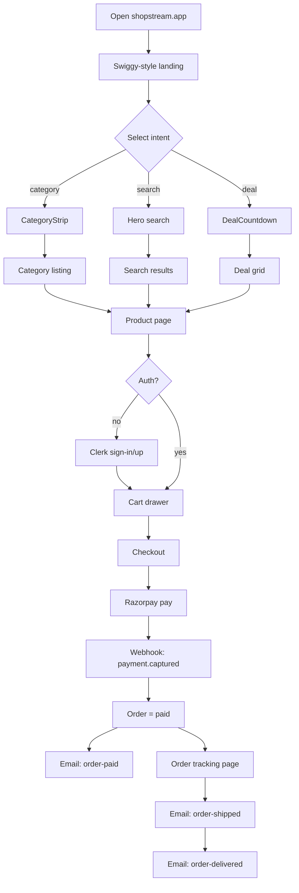
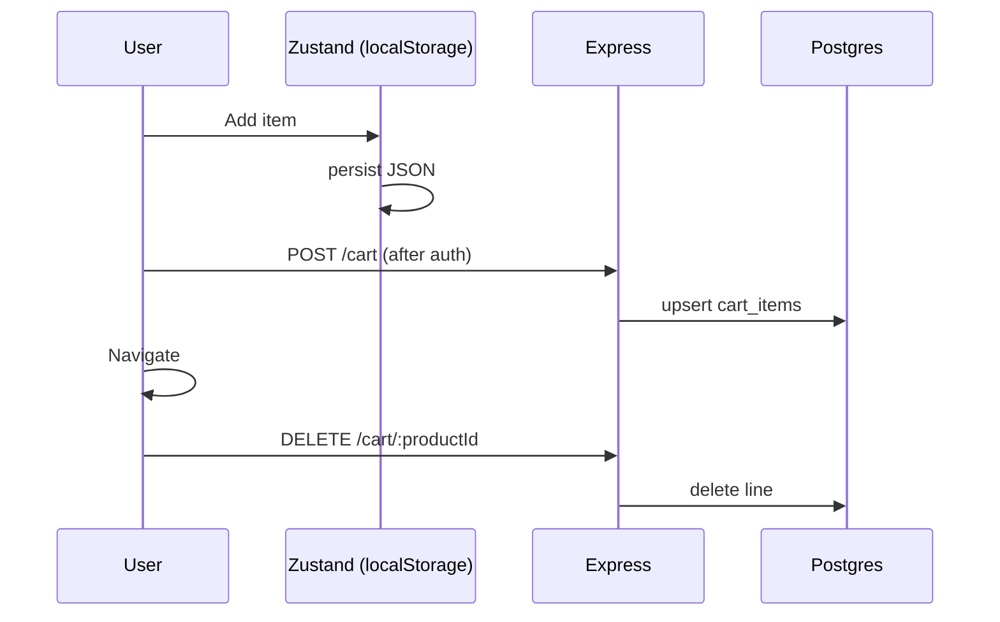
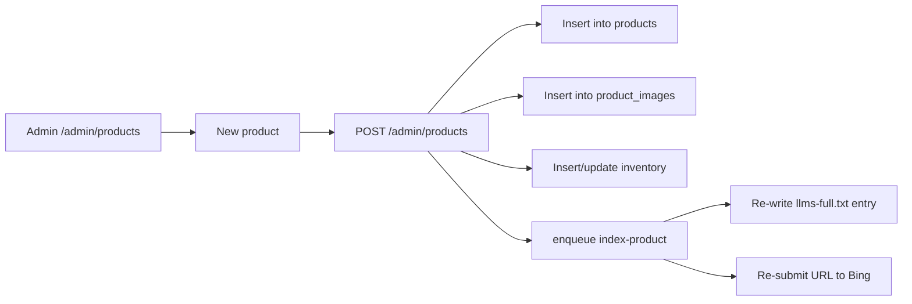
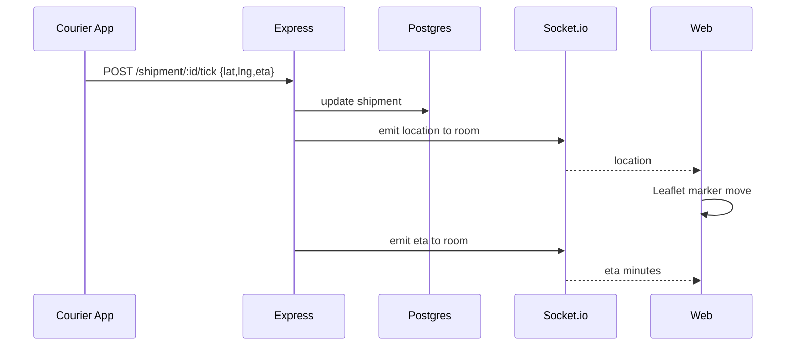
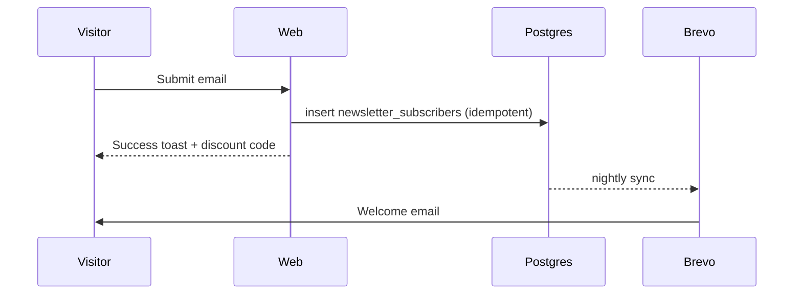
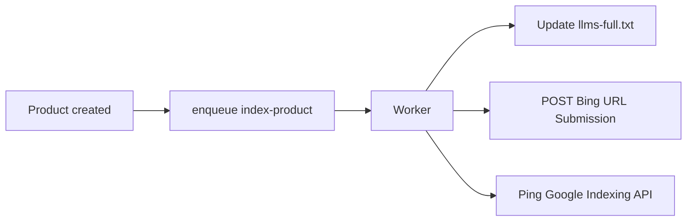
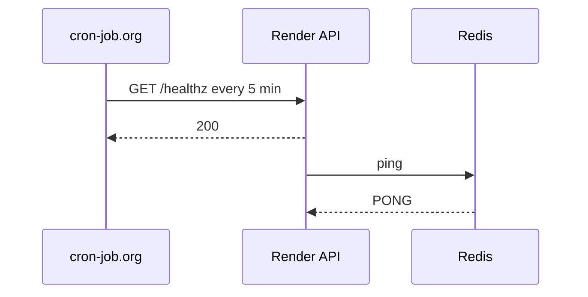
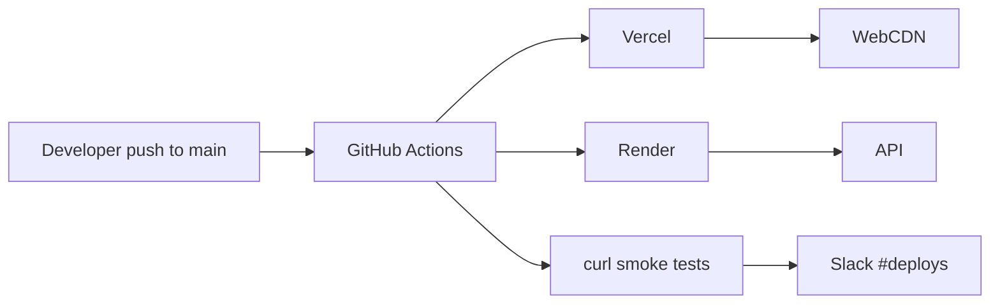

# ShopStream — Workflows

> End-to-end user and admin flows. Mermaid diagrams describe happy paths; edge cases live in `EDGE_CASES.md`.

## 1. Discovery → Purchase

## 2. Cart Lifecycle

## 3. Admin (Catalog CRUD)

## 4. Realtime Tracking

## 5. Newsletter Signup

## 6. Search Indexing Loop

## 7. Health & Keep-alive

## 8. Deployment Workflow

